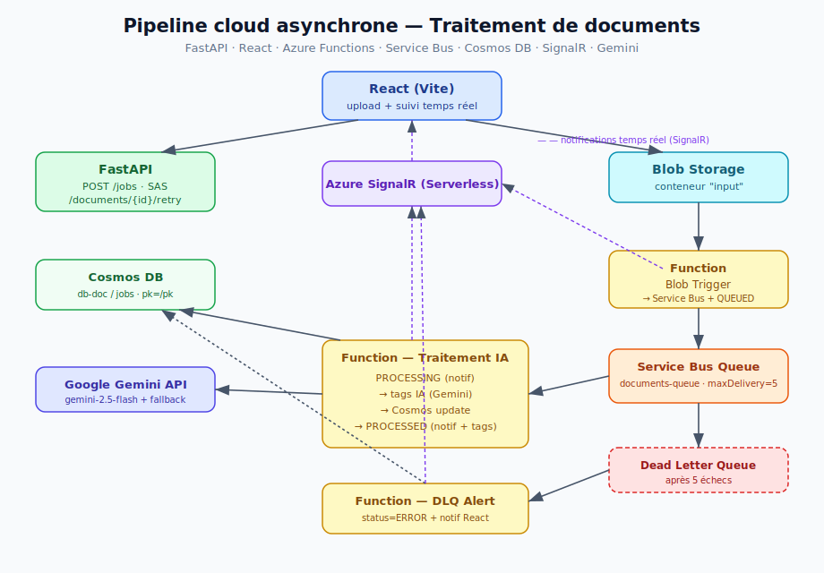

# Pipeline cloud asynchrone — Traitement de documents avec IA, notifications temps réel et DLQ

Projet académique (M2) — architecture cloud événementielle sur Microsoft Azure.

À l'upload d'un document, un pipeline asynchrone le tague automatiquement via
une IA, met à jour la base de données, notifie l'interface en temps réel, et
gère les erreurs via une Dead Letter Queue.

---

## Architecture



```
React (upload + suivi temps réel)
  │  POST /jobs + upload SAS
  ▼
FastAPI ──► Cosmos DB (création doc, statut CREATED)
  │
  └──► Blob Storage (conteneur "input")
            │  blob déposé : {documentId}_{fileName}
            ▼
        Function Blob Trigger
            ├─ publie un message dans Service Bus
            ├─ passe le document en QUEUED
            └─ notifie React : UPLOADED
                    │
                    ▼
            Service Bus Queue (documents-queue, maxDeliveryCount = 5)
                    │
                    ▼
            Function Traitement IA
            ├─ PROCESSING (+ notif React)
            ├─ tags via Google Gemini (fallback par règles)
            ├─ met à jour Cosmos DB
            └─ PROCESSED (+ notif React avec tags)
                    │
                    │ en cas d'échecs répétés (5 tentatives)
                    ▼
            Dead Letter Queue
                    │
                    ▼
            Function DLQ Alert
            ├─ status = ERROR dans Cosmos (+ raison)
            └─ notifie React : ERROR
```

---

## Stack technique

| Couche | Technologie |
|--------|-------------|
| Frontend | React (Vite), `@microsoft/signalr` |
| Backend API | FastAPI (Python 3.11) |
| Functions | Azure Functions (Python v2, modèle decorators) |
| Messagerie | Azure Service Bus (Standard) |
| Base de données | Azure Cosmos DB |
| Stockage fichiers | Azure Blob Storage |
| Temps réel | Azure SignalR Service (mode Serverless) |
| IA (tagging) | Google Gemini API (`gemini-2.5-flash`) + fallback par règles |
| CI/CD | GitHub Actions (build + déploiement automatiques) |

---

## Ressources Azure utilisées

| Ressource | Nom | Rôle |
|-----------|-----|------|
| Cosmos DB | `iot-db1` (base `db-doc`, conteneur `jobs`) | Stockage des documents |
| Storage Account | `iotstockage` (conteneur `input`) | Dépôt des fichiers |
| Service Bus | `sb-docvl` (queue `documents-queue`) | File de messages + DLQ |
| SignalR | `signalr-docvl` (Serverless) | Notifications temps réel |
| Function App | `func-docvl` (Linux, Python 3.11) | Hébergement des Functions |
| Static Web App | `swa-docvl` | Hébergement du frontend |

---

## États métier

```
CREATED → UPLOADED → QUEUED → PROCESSING → PROCESSED
                                       ↘ ERROR
```

---

## Fonctionnalités implémentées

| # | Fonctionnalité | Emplacement |
|---|----------------|-------------|
| 1 | Function Blob Trigger | `src/functions/function_app.py` → `blob_trigger_documents` |
| 2 | Function de traitement IA | `function_app.py` → `process_document` |
| 3 | Tagging IA (Gemini + fallback) | `src/functions/tagging.py` |
| 4 | Notifications temps réel SignalR | `signalr_client.py`, `src/web/src/services/signalr.js` |
| 5 | Dead Letter Queue (maxDeliveryCount = 5) | Service Bus + `function_app.py` |
| 6 | Function DLQ Alert | `function_app.py` → `dlq_alert` |
| 7 | Endpoint de relance | `src/api/app/routes_documents.py` → `POST /documents/{id}/retry` |
| 8 | Observabilité (logs structurés JSON) | logs `step`/`status`/`documentId` dans toutes les Functions |

---

## Structure du projet

```
.
├── .github/workflows/deploy.yml     Pipeline CI/CD (6 étapes)
├── src/
│   ├── api/                         Backend FastAPI
│   │   └── app/
│   │       ├── main.py
│   │       ├── routes_jobs.py       création doc + SAS
│   │       ├── routes_signalr.py    négociation SignalR
│   │       ├── routes_documents.py  endpoint retry
│   │       ├── cosmos.py
│   │       ├── blob_service.py
│   │       └── config.py
│   ├── functions/                   Azure Functions
│   │   ├── function_app.py          3 Functions (trigger, traitement, DLQ)
│   │   ├── tagging.py               tagging IA Gemini + fallback
│   │   ├── signalr_client.py        helper notifications
│   │   ├── host.json
│   │   └── requirements.txt
│   └── web/                         Frontend React
│       └── src/
│           ├── App.jsx
│           └── services/
│               ├── api.js
│               ├── blob.js
│               └── signalr.js
└── .gitignore                       exclut .env et local.settings.json
```

---

## Lancer le projet en local

Le projet nécessite **3 processus** lancés en parallèle (3 terminaux).

### Prérequis
- Python 3.11 (obligatoire pour les Functions)
- Node.js 20
- Azure Functions Core Tools v4

### 1. Backend FastAPI
```bash
cd src/api
python -m venv venv
.\venv\Scripts\Activate.ps1      # Windows
pip install -r requirements.txt
# créer un fichier .env (voir .env.example)
uvicorn app.main:app --reload
```

### 2. Azure Functions
```bash
cd src/functions
py -3.11 -m venv .venv
.\.venv\Scripts\Activate.ps1
pip install -r requirements.txt
# créer un fichier local.settings.json (voir local.settings.json.example)
func start
```

### 3. Frontend React
```bash
cd src/web
npm install
npm run dev
```

Puis ouvrir l'URL affichée par Vite (ex. `http://localhost:5173`).

---

## Variables de configuration

Les secrets ne sont **jamais** commités (exclus via `.gitignore`).

**Backend** (`src/api/.env`) : `cosmos_endpoint`, `cosmos_key`, `cosmos_database`,
`cosmos_container`, `blob_connection_string`, `blob_container`,
`SIGNALR_CONNECTION_STRING`, `SERVICE_BUS_CONNECTION_STRING`, `SERVICE_BUS_QUEUE`.

**Functions** (`src/functions/local.settings.json`) : `AzureWebJobsStorage`,
`SERVICE_BUS_CONNECTION_STRING`, `SERVICE_BUS_QUEUE`, `COSMOS_ENDPOINT`,
`COSMOS_KEY`, `COSMOS_DATABASE`, `COSMOS_CONTAINER`, `GEMINI_API_KEY`,
`GEMINI_MODEL`, `SIGNALR_CONNECTION_STRING`, `SIGNALR_HUB`.

---

## CI/CD

Le pipeline `.github/workflows/deploy.yml` s'exécute à chaque push sur `main`
et couvre les 6 étapes demandées :

1. installation des dépendances (Python)
2. vérification du code (compilation)
3. build du frontend React
4. déploiement du frontend (Azure Static Web Apps)
5. déploiement des Azure Functions
6. secrets via **GitHub Secrets** (équivalent des variables CI/CD)

Secrets configurés : `AZURE_CLIENT_ID`, `AZURE_CLIENT_SECRET`, `AZURE_TENANT_ID`,
`AZURE_SUBSCRIPTION_ID`, `AZURE_FUNCTION_APP_NAME`, `AZURE_STATIC_WEB_APP_TOKEN`.

---

## Gestion des erreurs (DLQ)

Un message part en Dead Letter Queue après **5 tentatives** échouées.
Cas déclencheurs :
- message mal formé (JSON invalide / champ manquant)
- document introuvable dans Cosmos
- échec répété de l'appel IA
- exception non gérée dans la Function de traitement

La Function `dlq_alert` lit la sous-file `documents-queue/$DeadLetterQueue`,
passe le document en `ERROR` dans Cosmos avec la raison, et notifie React.

---

## Choix techniques notables

**Google Gemini au lieu d'Azure OpenAI** : Azure OpenAI n'est pas accessible
sur les abonnements *Azure for Students*. L'API Gemini (niveau gratuit) a été
retenue, avec un **fallback déterministe par règles** qui garantit que le
pipeline ne se bloque jamais si l'IA est indisponible.

**Modèle Python v2 pour les Functions** : les trois Functions sont regroupées
dans un seul `function_app.py` via des decorators, approche moderne et lisible.

**Convention de nommage des blobs** : `{documentId}_{fileName}` dans le
conteneur `input`, ce qui permet à la Blob Trigger de retrouver le document
en coupant au premier underscore.

---

## Tests fonctionnels

| Scénario | Résultat attendu |
|----------|------------------|
| fichier valide | `PROCESSED` |
| document introuvable | `ERROR` (via DLQ) |
| message mal formé | `DLQ` |
| échec IA | fallback par règles puis `PROCESSED` |
